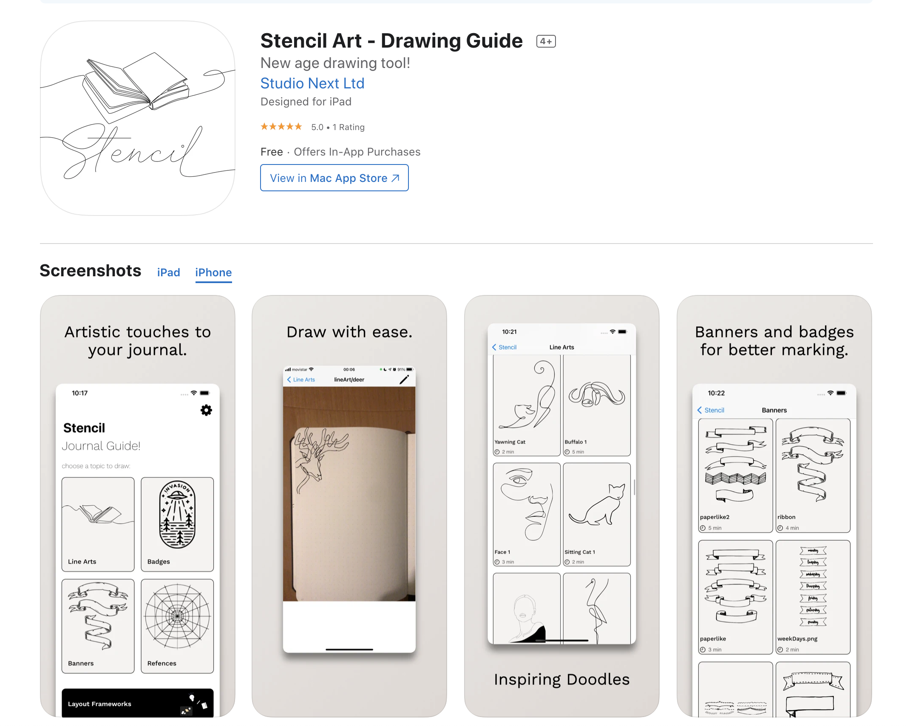

<!-- ---
title: Stencil Art - Journal Guide 
layout: landing
description: 'Stencil provides guide lines for your amazing journals.  With badges and line art your journals would be more artistic and inspirational.'
image: assets/images/stencilBanner.jpg
nav-menu: false
---

<!-- Main -->

<!-- One -->
<section id="one">
	

		<header class="major">
			<h2>New Generation Drawing!</h2>
		</header>
		

		We believe that journaling is very personal and creative process when your reflection is supported with cool doodles with your own hand drawings, it becomes emotional markers. Even for the least talented doodlers it's very easy to draw with the guides. You need to follow the line as much as you can no worries, no need to make it perfect. Come on! we all know nothing in this world is perfect. 
		
		We also need to warn you that after couple of times drawing the same doodle you can find yourself in the flow and forgetting about all your troubles.
		

		
	

</section> -->
